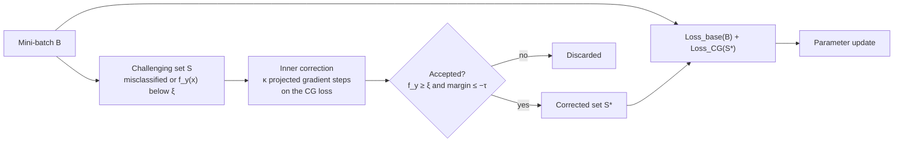

# SARA: Self-Adaptive Revisiting Awareness

[](https://github.com/khalooei/SARA/actions/workflows/tests.yml)


[](LICENSE)
[](https://khalooei.github.io/SARA/)

Official PyTorch implementation of **"Self-Adaptive Revisiting Awareness for Enhancing Robustness and
Generalization in Classification Tasks"** by Mohammad Khalooei, Maryam Amirmazlaghani and Mohammad Mehdi
Homayounpour.

SARA is a training strategy that focuses on the samples a model currently finds hardest. In every
iteration it identifies the misclassified and low-confidence samples of the mini-batch, moves each of them
to a nearby point that the model classifies correctly with sufficient confidence and margin, and adds the
successfully corrected samples to the batch. The correction is driven by the **Confidence Guard (CG) loss**,
and SARA can be combined with standard training or with adversarial training (PGD, TRADES, MART).

## Highlights

- **Confidence Guard loss.** A cross-entropy pull toward the true class plus a hinge penalty on the
  classification margin. The hinge term vanishes exactly when the margin condition is met, so the inner
  search receives a gradient until the acceptance criterion holds.
- **Plug-in design.** SARA wraps any base loss: cross-entropy, PGD adversarial training, TRADES or MART.
  A new base loss only needs a `compute(model, x, y, epsilon)` method.
- **Batched inner correction.** All challenging samples of a batch are corrected in one tensor operation
  (one forward and one backward pass per inner iteration), so the overhead scales with the number of
  challenging samples rather than with the batch size.
- **Exact projection.** Every inner iterate is projected onto the intersection of the L∞ ball and the valid
  pixel range; corrected samples are detached, so no gradient flows through the inner search.
- **Class-count-relative confidence threshold.** The threshold is expressed relative to chance level
  (ξ_eff = ξ · 10 / C), which keeps it meaningful on datasets with 100 or 200 classes.
- **Stabilization options.** Correction budget, warmup, confidence-based reweighting, success-rate damping
  and a confidence-capped CG loss, each available as a single flag.
- **Baselines in the same pipeline.** GAIRAT, FAT and OHEM share the training and evaluation code of SARA.
- **Tested.** Unit tests check the properties the method relies on, including the admissibility of every
  corrected sample and the bounds satisfied by the CG loss.

## Method



For a sample `(x, y)` with true-class probability `f_y(x)` and margin `h(x, y) = max_{j≠y} f_j(x) − f_y(x)`:

| Component | Definition |
|---|---|
| Challenging set | `S = {(x, y) ∈ B : argmax_j f_j(x) ≠ y  or  f_y(x) < ξ}` |
| Acceptance region | `Ω = {x : f_y(x) ≥ ξ  and  h(x, y) ≤ −τ}` |
| CG loss (per sample) | `L_CG(x, y) = CE(f(x), y) + λ_margin · ReLU(h(x, y) + τ)` |
| Inner update | `δ ← Π_Δ(δ − α ∇_δ L_CG(x + δ, y))`, with `Δ = {δ : ‖δ‖∞ ≤ ε, x + δ ∈ [0, 1]^d}` |
| Outer objective | `Loss_SARA = Loss_base(B) + mean_{S*} L_CG` |

The implementation follows Algorithm 1 of the paper: [`sara/confidence_guard.py`](sara/confidence_guard.py)
contains the challenging-set identification, the CG loss and the inner correction, and
[`sara/trainer.py`](sara/trainer.py) contains the outer training step.

## Installation

```bash
git clone https://github.com/khalooei/SARA.git
cd SARA
pip install -e .            # or: pip install -r requirements.txt
```

Python 3.9 or later and PyTorch 2.1 or later are required. A CUDA GPU is recommended; on GPUs, forward
passes run in bfloat16 autocast.

## Quick start

Train LeNet on MNIST with PGD adversarial training and SARA, and evaluate clean, PGD and APGD accuracy:

```bash
python train.py --dataset mnist --model lenet --base-loss pgd --sara \
    --epochs 20 --eval-apgd --out-dir runs/mnist/at_pgd_sara
```

Each run writes its configuration (`config.json`), one JSON line per epoch (`train_log.jsonl`) and the final
weights (`model_final.pt`) to `--out-dir`.

SARA can also be used inside your own training loop:

```python
import torch
from sara import SARAConfig, build_base_loss, sara_training_step

base_loss = build_base_loss("pgd")                      # "ce", "pgd", "trades" or "mart"
cfg = SARAConfig(epsilon=0.2, tau=0.05, xi=0.5, kappa=10)
optimizer = torch.optim.SGD(model.parameters(), lr=0.01, momentum=0.9, weight_decay=5e-4)

for x, y in train_loader:
    stats = sara_training_step(model, optimizer, x, y, base_loss, cfg, base_loss_kwargs={"pgd_steps": 7})
```

`stats` reports the losses, the number of challenging and corrected samples and the correction success rate
of the step.

## Datasets

MNIST, CIFAR10, CIFAR100 and SVHN are downloaded automatically by torchvision. For Tiny-ImageNet-200,
download [tiny-imagenet-200.zip](https://cs231n.stanford.edu/tiny-imagenet-200.zip) and unzip it into the data
directory. Data are stored in `./data` by default; set `SARA_DATA_ROOT` to use another location.

| Dataset | Classes | Input size | Model | Default ε (L∞) |
|---|---|---|---|---|
| MNIST | 10 | 28 × 28 | LeNet | 0.2 |
| CIFAR10 | 10 | 32 × 32 | ResNet18 | 0.03 |
| SVHN | 10 | 32 × 32 | ResNet18 | 0.03 |
| CIFAR100 | 100 | 32 × 32 | ResNet18 | 0.03 |
| Tiny-ImageNet-200 | 200 | 64 × 64 | ResNet18 | 0.03 |

Images are kept in `[0, 1]` without per-channel normalization, so perturbation budgets are expressed in
pixel space.

## Training options

| Option | Default | Description |
|---|---|---|
| `--base-loss {ce,pgd,trades,mart}` | `ce` | Base training loss |
| `--sara` | off | Enable SARA |
| `--method {default,ohem,fat,gairat}` | `default` | Use a baseline training step instead |
| `--sara-epsilon` | AT ε | Radius of the correction search |
| `--xi` | 0.5 | Confidence threshold (for 10 classes) |
| `--xi-relative` / `--no-xi-relative` | relative | Rescale ξ to ξ · 10 / C |
| `--tau` | 0.05 | Margin threshold |
| `--kappa` | 10 | Maximum number of inner iterations |
| `--alpha` | 2ε / κ | Inner step size |
| `--lambda-margin` | 1.0 | Weight of the hinge term of the CG loss |
| `--sara-max-correct` | 0 (off) | Correction budget: maximum challenging samples corrected per batch |
| `--sara-warmup-epochs` | 0 | Initial epochs trained with the base loss only |
| `--gamma-reweight` | 0 (off) | Confidence-based reweighting of the base loss |
| `--cg-damping` | off | Scale the CG loss by (1 − correction success rate) |
| `--cg-confidence-cap` | off | Cap the cross-entropy term of the outer CG loss at ξ |
| `--eval-apgd` | off | Also evaluate APGD-CE accuracy (PGD-20 is always evaluated) |

Run `python train.py --help` for the complete list.

## Reproducing the experiments

The scripts in [`experiments/`](experiments) contain the exact commands of the controlled-protocol
experiments of the paper. Outputs are written to `runs/` (set `OUT` to change it).

| Script | Content |
|---|---|
| `controlled_mnist.sh` | SARA with each base loss and the OHEM, FAT and GAIRAT baselines on MNIST |
| `controlled_cifar10.sh` | SARA with each base loss and GAIRAT on CIFAR10 |
| `controlled_svhn.sh` | SARA with each base loss on SVHN |
| `controlled_cifar100.sh` | Class-count-relative and unscaled confidence thresholds on CIFAR100 |
| `controlled_tinyimagenet.sh` | Standard training with and without SARA on Tiny-ImageNet-200 |
| `stabilization.sh` | Correction budget, warmup, reweighting, damping and confidence cap |
| `analysis.sh` | Hyperparameter ablation, multi-seed runs, hyperparameter search, overhead, corruptions |

GPU kernels are not bit-wise deterministic, so re-runs can differ slightly from run to run. The
tuned-protocol experiments of the paper were run with a separate framework and are not part of this
repository.

## Repository structure

```
SARA/
├── sara/                    # the package
│   ├── confidence_guard.py  # challenging set, CG loss, batched inner correction
│   ├── trainer.py           # SARA training step (outer objective)
│   ├── losses.py            # base losses: CE, PGD-AT, TRADES, MART
│   ├── baselines.py         # GAIRAT, FAT and OHEM training steps
│   ├── attacks.py           # PGD and APGD
│   ├── evaluate.py          # clean, PGD and APGD accuracy
│   ├── lipschitz.py         # local Lipschitz estimate
│   ├── models.py            # LeNet and ResNet18
│   ├── data.py              # data loaders
│   └── tiny_imagenet.py     # Tiny-ImageNet-200 dataset
├── train.py                 # training entry point
├── scripts/                 # analysis experiments
├── experiments/             # commands of the paper's experiments
└── tests/                   # unit tests
```

## Tests

```bash
pip install -e ".[dev]"
pytest
```

## Citation

If you use this code, please cite:

```bibtex
@misc{khalooei2026sara,
  title  = {Self-Adaptive Revisiting Awareness for Enhancing Robustness and Generalization in Classification Tasks},
  author = {Khalooei, Mohammad and Amirmazlaghani, Maryam and Homayounpour, Mohammad Mehdi},
  year   = {2026},
  howpublished = {\url{https://github.com/khalooei/SARA}}
}
```

## License

This project is released under the [MIT License](LICENSE).
